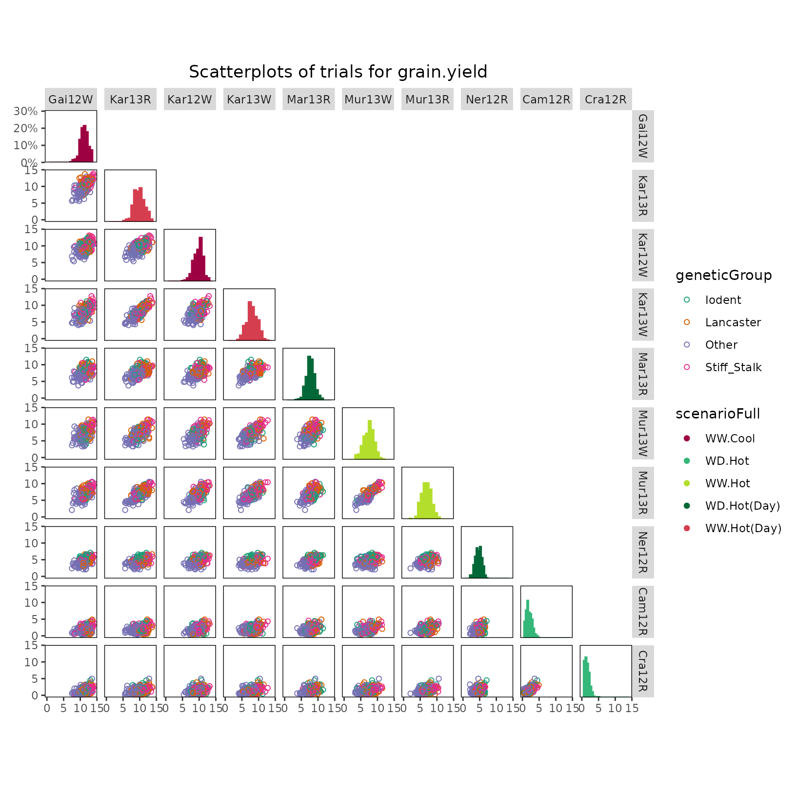
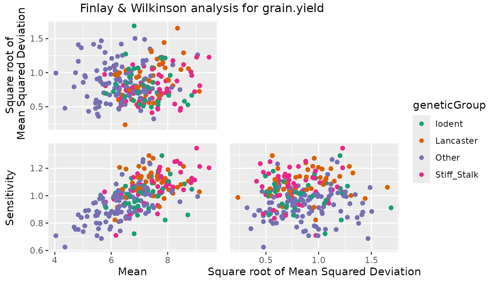
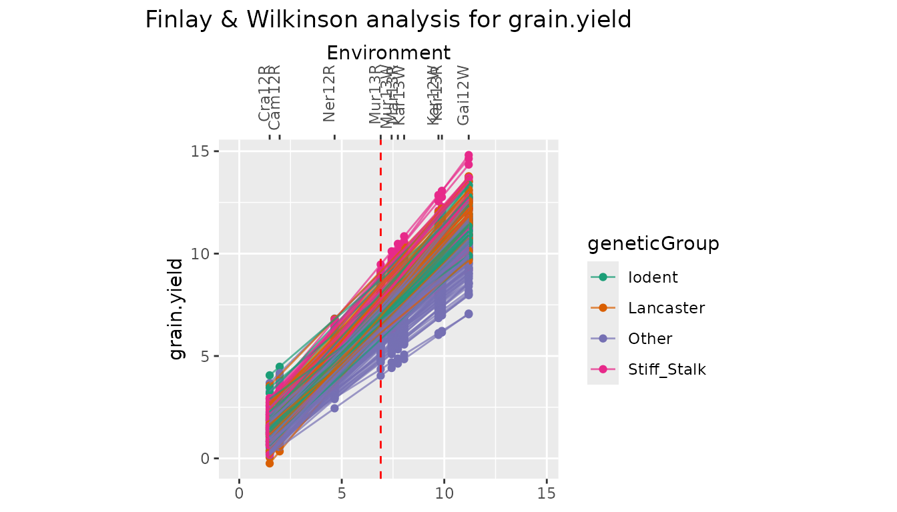
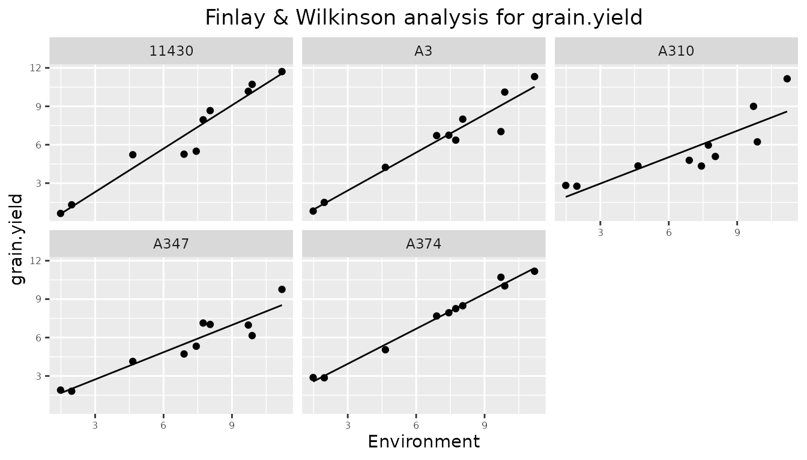
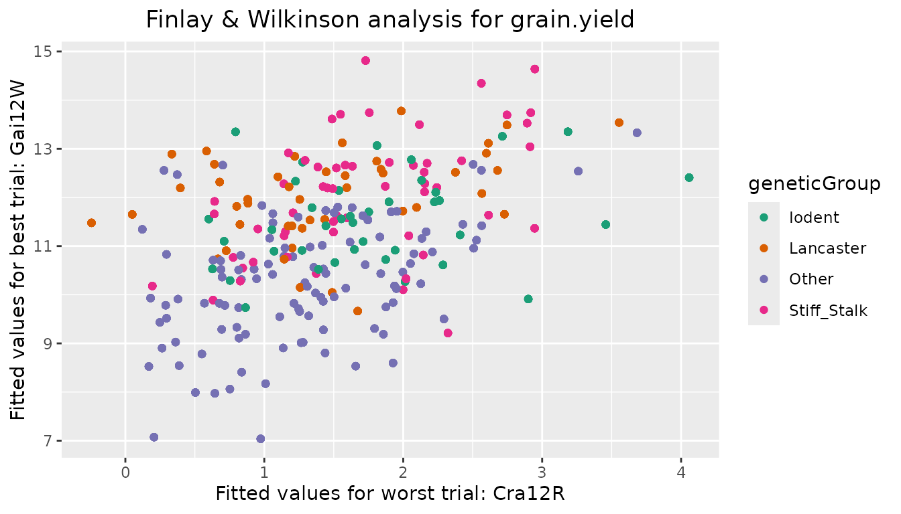
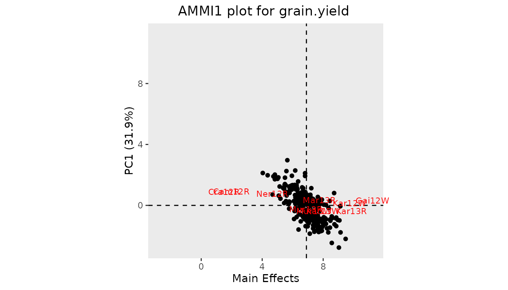
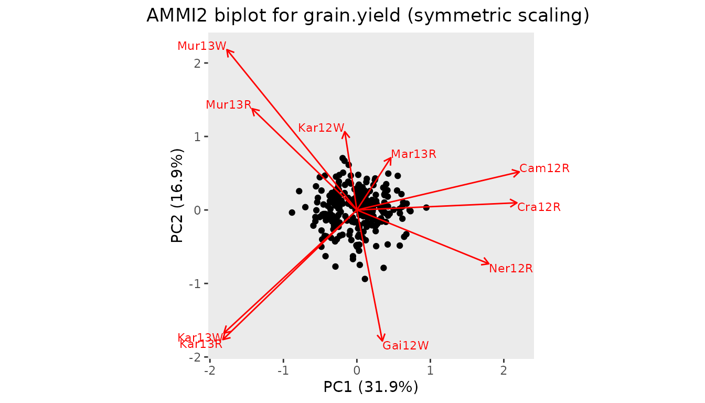
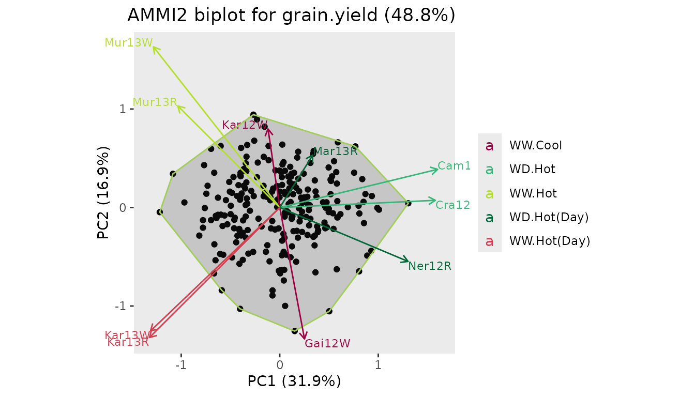
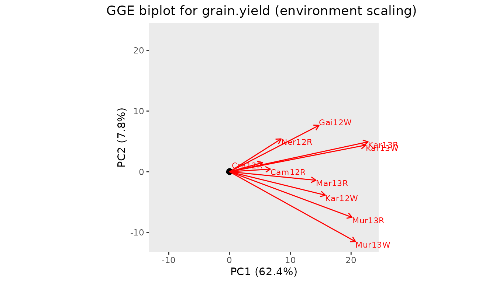
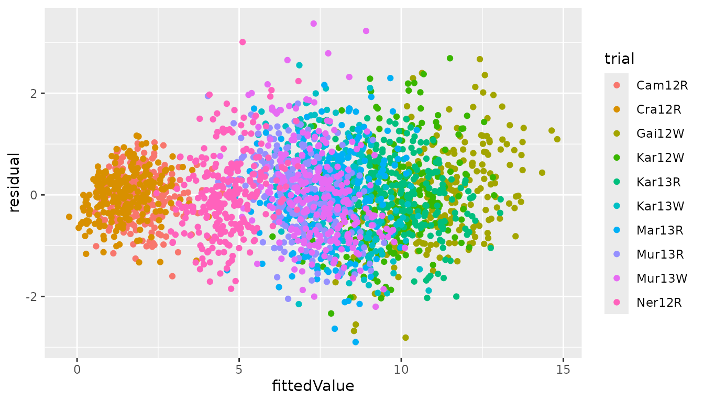

# Genotype by Environment analysis using statgenGxE

## The statgenGxE package

The statgenGxE package is developed as an easy-to-use package for
Genotype by Environment (GxE) analysis for data of plant breeding
experiments with many options for plotting and reporting the results of
the analyses.

This vignette describes how to perform the different types of analysis
that are available in the package. The availability of functions in the
package is based on the analyses described in Malosetti, Ribaut, and van
Eeuwijk (2013). Further suggested reading is van Eeuwijk, Bustos-Korts,
and Malosetti (2016).

The following types of analysis can be done using statgenGxE:

- [Mixed model analysis of GxE table of means](#vcomp)
- [Finlay-Wilkinson Analysis](#fw)
- [AMMI Analysis](#am)
- [GGE Analysis](#gge)
- [Identifying mega environments](#me)
- [Stability measures](#st)
- [Modeling of heterogeneity of genetic variances and
  correlations](#vcov)

For most of the analyses a pdf report can be created automatically, see
[Reporting](#rep).

Note that due to technical restrictions the number of significant digits
printed in tables throughout this vignette is not always optimal. In
practice precision of the output can always be specified by the user.

------------------------------------------------------------------------

## Data preparation

The use of the package is demonstrated using maize data from the
European Union project DROPS
(<https://cordis.europa.eu/project/id/244374>). The data is available
from <https://doi.org/10.15454/IASSTN> (E. J. Millet et al. 2019) and
the relevant data set is included as data.frame in the statgenGxE
package.

The first step is loading the data into R.

``` r
data(dropsPheno)
```

dropsPheno contains data for the genotypic means (Best Linear Unbiased
Estimators, BLUEs), with one value per genotype per experiment, for a
selection of 10 experiments from the full data set and eight traits.
These 10 experiments form a good representation of the full set of
experiments covering the five scenarios described in E. Millet et al.
(2016). Throughout this vignette in all examples the trait grain.yield
will be analyzed. For a more detailed description of the contents of the
data see [`help(dropsPheno)`](../reference/dropsPheno.md).

The input for GxE analysis in the statgenGxE package is an object of
class TD (Trial Data). For a detailed description on how to construct
such an object see the vignette of the statgenSTA package
(`vignette("statgenSTA")`). For GxE analysis it is enough to specify the
genotype and trial option of the `createTD` function.

``` r
## Create a TD object from dropsPheno.
dropsTD <- statgenSTA::createTD(data = dropsPheno, genotype = "Variety_ID", trial = "Experiment")
```

Before doing any analysis, we can first have a look at the contents of
the data. To explore heterogeneity of genetic variance we can create a
box plot. Coloring the boxes by environmental scenario will provide
valuable extra information.

``` r
## Create a box plot of dropsTD.
## Color the boxes based on the variable scenarioFull.
## Plot in  descending order.
plot(dropsTD, plotType = "box", traits = "grain.yield", colorTrialBy = "scenarioFull",
     orderBy = "descending")
```


From the plot it is clear that the trials in the hot, water deficient
environments have a lower median and range than the other trials.

For further insight into the correlation structure between trials a
scatter plot matrix can be made.

``` r
## Create a scatter plot of dropsTD.
## Color the genotypes based on the variable geneticGroup.
## Color the histograms for trials based on the variable scenarioFull.
plot(dropsTD, plotType = "scatter", traits = "grain.yield", colorGenoBy = "geneticGroup", 
     colorTrialBy = "scenarioFull", 
     trialOrder = c("Gai12W", "Kar13R", "Kar12W", "Kar13W", "Mar13R", "Mur13W",
                    "Mur13R", "Ner12R", "Cam12R", "Cra12R"))
```



### Coloring of genotypes and trials

In all plots the default colors for both genotype groups and trial
groups are chosen from a predefined color palette. For genotype groups
the color palette is “Dark 2”, for trial groups it is “Alphabet”. See
[here](https://developer.r-project.org/Blog/public/2019/11/21/a-new-palette-for-r/index.html)
for an overview of these colors.

It is possible to specify different colors for genotype groups and trial
groups per plot using the options `colGeno` and `colTrial` respectively.
Also, more conveniently, the default colors can be set using the options
statgen.genoColors and statgen.trialColors.

``` r
## Set default colors for genotypes and trials.
options("statgen.genoColors" = c("blue", "green", "yellow"))
options("statgen.trialColors" = c("red", "brown", "purple"))
```

If a plot has more genotype groups than the number of colors specified
as default colors, the default colors will be ignored and `topo.colors`
will be used instead. For trial groups this is done in a similar way.

------------------------------------------------------------------------

## Mixed model analysis of GxE table of means

To investigate the structure of the genotype by environment data various
mixed models can be fitted. In the statgenGxE package this can be done
using the `gxeVarComp` function.

Six different types of models can be fitted depending on the structure
of the environments in the data. These models are described in the table
below, together with the function parameters used in `gxeVarComp` to fit
the model.

| Structure of environments                                  | Model                                                                                                                                                                                                               | Function parameters          |
|:-----------------------------------------------------------|:--------------------------------------------------------------------------------------------------------------------------------------------------------------------------------------------------------------------|:-----------------------------|
| Environments correspond to trials                          | **trait** = trial + **genotype + genotype:trial**                                                                                                                                                                   |                              |
| Trials form a factorial structure of locations x years     | **trait** = year + location + year:location + **genotype + genotype:year + genotype:location + genotype:year:location**                                                                                             | `locationYear = TRUE`        |
| Trials are nested within year                              | **trait** = year + year:trial + **genotype + genotype:year + genotype:year:trial**                                                                                                                                  | `nestingFactor = "year"`     |
| Trials are nested within locations                         | **trait** = location + location:trial + **genotype + genotype:location + genotype:location:trial**                                                                                                                  | `nestingFactor = "loc"`      |
| Trials correspond to locations within regions across years | **trait** = region + region:location + year + region:year + region:location:year + **genotype + genotype:region + genotype:region:location + genotype:year + genotype:region:year + genotype:region:location:year** | `regionLocationYear = TRUE`  |
| Trials are nested within scenarios                         | **trait** = scenario + scenario:trial + **genotype + genotype:scenario + genotype:scenario:trial**                                                                                                                  | `nestingFactor = "scenario"` |

For data in the form of GxE means, the last random term in all models
above will become a residual term. If the GxE means are provided
together with weights, then a residual term will be added to the models
above. Be aware that when plot data are provided as input data, the
mixed model analysis will be based on the assumption of completely
randomized trials, which in almost all cases will not be appropriate for
multi-environment trials.

All models can be fitted using either `lme4` or `asreml`. This can be
specified using the `engine` parameter.

For diagnostic purposes and to identify the main sources of variation,
all models are fitted three times:

1.  With all terms fixed
2.  With all terms random
3.  As a mixed model, with the **bold** terms as random and the others
    as fixed

### Model fitted with all terms as fixed

The function first fits a model where all model terms are included as
fixed terms. Based on the ANOVA table of this model, terms in the fixed
part of the model that are likely to give a problem when fitting the
mixed model are removed because of the reduced connectivity and number
of available observations to estimate that model term. Also a warning is
printed if the mean sum of squares for a model term points to a possible
zero variance component in the mixed model.

### Model fitted with all terms as random

Then a model is fitted where all model terms are included as random
terms. Based on the variance components in this model the percentage of
variance explained by each of the model components is determined. The
percentages of variance are printed in the model summary, together with
the variance components. The latter are presented on a standard
deviation scale.

### Mixed model

Finally a mixed model is fitted as specified in the table above. Based
on this model, variance components can be extracted, heritabilities on a
line mean basis (across all trials) can be computed and predictions can
be made. It is also possible to plot the results.

``` r
## Fit a model where trials are nested within scenarios.
dropsVarComp <- gxeVarComp(TD = dropsTD, trait = "grain.yield", nestingFactor = "scenarioFull")
summary(dropsVarComp)
#> Fitted model formula final mixed model
#> 
#>  grain.yield ~ scenarioFull + scenarioFull:trial + (1 | genotype) + (1 | genotype:scenarioFull) 
#> 
#> Sources of variation for fully random model:
#>  grain.yield ~ (1 | scenarioFull) + (1 | scenarioFull:trial) + (1 | genotype) + (1 | genotype:scenarioFull) 
#> 
#>                       Component % Variance expl.
#> scenarioFull              10.25          75.51 %
#> scenarioFull:trial         1.58          11.64 %
#> genotype                   0.82           6.02 %
#> genotype:scenarioFull      0.38           2.77 %
#> residuals                  0.55           4.06 %
#> 
#> Analysis of Variance Table for fully fixed model:
#>  grain.yield ~ scenarioFull + scenarioFull:trial + genotype + genotype:scenarioFull 
#> 
#>                         Df  Sum Sq Mean Sq  F value    Pr(>F)    
#> scenarioFull             4 21730.5  5432.6 9859.988 < 2.2e-16 ***
#> scenarioFull:trial       5  1946.8   389.4  706.658 < 2.2e-16 ***
#> genotype               245  2320.6     9.5   17.191 < 2.2e-16 ***
#> genotype:scenarioFull  980  1278.1     1.3    2.367 < 2.2e-16 ***
#> residuals             1225   674.9     0.6                       
#> ---
#> Signif. codes:  0 '***' 0.001 '**' 0.01 '*' 0.05 '.' 0.1 ' ' 1
```

Note that because the model is fitted with lme4, in this and further
tables no standard errors are outputted. When using asreml for modeling
standard errors will be available.

The diagnostics for the fitted model can be printed using the
`diagnostics` function. This will print an incidence matrix of missing
values for each of the terms in the random part of the fitted model.

``` r
## Print diagnostics - output suppressed because of the large number of rows.
diagnostics(dropsVarComp)
```

Extracting the variance components from the fitted model can be done
using the `vc` function. The heritability (across trials) is computed
using `herit`.

``` r
## Extract variance components.
vc(dropsVarComp)
#>                       Component
#> genotype                 0.8167
#> genotype:scenarioFull    0.3766
#> residuals                0.5510
## Compute heritability.
herit(dropsVarComp)
#> [1] 0.8623
```

A plot can be made of the square roots of the variance component
estimates. These are based on the fully random model.

``` r
## Plot the results of the fitted model.
plot(dropsVarComp)
```

 Predictions for the
mixed model can be made for model terms that represent different levels
of data aggregation; for the genotype main effect or for genotypic
performance in grouped environments, or for genotypic performance in
individual trials. These levels can be specified by the parameter
`predictLevel`.

``` r
## Predictions of the genotype main effect.
predGeno <- predict(dropsVarComp)
head(predGeno)
#>   genotype predictedValue
#> 1    11430          6.740
#> 2       A3          6.368
#> 3     A310          5.821
#> 4     A347          5.688
#> 5     A374          7.422
#> 6     A375          6.671
## predictions at the level of genotype x scenarioFull.
predGenoTrial <- predict(dropsVarComp, predictLevel = "scenarioFull")
head(predGenoTrial)
#>   genotype scenarioFull predictedValue
#> 1    11430       WD.Hot          1.230
#> 2    11430  WD.Hot(Day)          6.359
#> 3    11430      WW.Cool         10.681
#> 4    11430       WW.Hot          6.054
#> 5    11430  WW.Hot(Day)          9.301
#> 6       A3       WD.Hot          1.179
```

------------------------------------------------------------------------

## Finlay-Wilkinson Analysis

With the Finlay-Wilkinson Analysis (Finlay and Wilkinson 1963) we
describe genotype by environment interaction by the heterogeneity of the
slopes of a regression of individual genotypic performance on an
environmental index. The environmental index is the average of all
genotypes in an environment. The intercept expresses general performance
across all environments, the slope represents adaptability, and the
residuals may indicate a measure for stability.

The model fitted in the analysis is y\_{ij} = \mu + G_i + \beta_iE_j +
\epsilon\_{ij}, where y\_{ij} is the phenotypic value of genotype i in
environment j, \mu is the general mean, G_i is the genotypic effect,
\beta_i a sensitivity parameters, E_j the environment effect and
\epsilon\_{ij} a residual.

In the statgenGxE package this analysis can be done using the `gxeFW`
function. The model described above is fitted using an alternating
regression algorithm. First, using starting values for \beta_i and G_i,
E_j is estimated. Next, E_j is assumed known and \beta_i and G_i are
estimated. This process is continued until convergence, i.e. until the
change in \beta_i between iterations is less then a specified tolerance
(default 0.001). When estimating parameters, missing observations are
estimated as well.

By default all trials in the `TD` object are used in the analysis, but
this can be restricted using the parameter `trials`. The genotypes
included in the analysis can be restricted using `genotypes`.

``` r
## Perform a Finlay-Wilkinson analysis for all trials.
dropsFW <- gxeFw(TD = dropsTD, trait = "grain.yield")
#> Warning in anova.lm(modelA): ANOVA F-tests on an essentially perfect fit are unreliable
summary(dropsFW)
#> Environmental effects 
#> =====================
#>     Trial      EnvEff SE_EnvEff  EnvMean SE_EnvMean Rank
#> 1  Cam12R -4.93055131 0.0502677  1.97041   0.526746    9
#> 2  Cra12R -5.41742682 0.0502677  1.48357   0.564494   10
#> 3  Gai12W  4.29123502 0.0502677 11.19147   0.478809    1
#> 4  Kar12W  2.81625299 0.0502677  9.71660   0.378874    3
#> 5  Kar13R  2.98370143 0.0502677  9.88404   0.389212    2
#> 6  Kar13W  1.14177738 0.0502677  8.04226   0.298928    4
#> 7  Mar13R  0.83539922 0.0502677  7.73591   0.290526    5
#> 8  Mur13R -0.00199929 0.0502677  6.89857   0.280534    7
#> 9  Mur13W  0.53205627 0.0502677  7.43259   0.284630    6
#> 10 Ner12R -2.25044489 0.0502677  4.65031   0.346564    8
#> 
#> Anova 
#> =====
#>                 Df Sum Sq Mean Sq  F value Pr(>F)    
#> Trial            9  23677  2630.8 3329.261 <2e-16 ***
#> Genotype       245   2321     9.5   11.986 <2e-16 ***
#> Sensitivities  245    404     1.6    2.088 <2e-16 ***
#> Residual      1960   1549     0.8                    
#> Total         2459  27951    11.4                    
#> ---
#> Signif. codes:  0 '***' 0.001 '**' 0.01 '*' 0.05 '.' 0.1 ' ' 1
#> 
#> Most sensitive genotypes
#> ========================
#>   Genotype GenMean SE_GenMean Rank    Sens   SE_Sens MSdeviation
#>     Lo1251 9.03024   0.280534    1 1.34769 0.0904213    1.507974
#>   DK78371A 7.34072   0.280534    2 1.29330 0.0904213    0.313889
#>      PHG83 7.79922   0.280534    3 1.29327 0.0904213    1.447104
#>      FR697 7.48625   0.280534    4 1.27406 0.0904213    0.917458
#>  SC-Malawi 7.12909   0.280534    5 1.26463 0.0904213    1.272097
```

Four types of plots can be made to investigate the output from the
analysis. `plotType = "scatter"` creates three scatter plots where
genotypic mean, square root of the mean squared deviation and
sensitivity are plotted against each other.

``` r
## Create scatter plot for Finlay Wilkinson analysis.
## Color genotypes by geneticGroup.
plot(dropsFW, plotType = "scatter", colorGenoBy = "geneticGroup")
```



With `plotType = "line"` a plot with fitted lines for all genotypes in
the analysis is created.

``` r
## Create line plot for Finlay Wilkinson analysis.
## Color genotypes by geneticGroup.
plot(dropsFW, plotType = "line", colorGenoBy = "geneticGroup")
```



`plotType = "trellis"` creates a trellis plot with observations and
slopes per genotype. At most 64 genotypes are plotted. It is possible to
select a subset of genotypes for plotting using the parameter
`genotypes`.

``` r
## Create trellis plot for Finlay Wilkinson analysis.
## Restrict to first 5 genotypes.
plot(dropsFW, plotType = "trellis", genotypes = c("11430", "A3", "A310", "A347", "A374"))
```



`plottType = "scatterFit"` creates a scatter plot of fitted values in
the trial with the highest environmental effect against the fitted
values in the trial with the lowest environmental effect.

``` r
## Create scatter plot of fitted values for Finlay Wilkinson analysis.
## Color genotypes by geneticGroup.
plot(dropsFW, plotType = "scatterFit", colorGenoBy = "geneticGroup")
```



------------------------------------------------------------------------

## AMMI Analysis

The Additive Main Effects and Multiplicative Interaction (AMMI) model
fits a model which involves the Additive Main effects (i.e. genotype and
trial) along with Multiplicative Interaction effects. The additive
effects are the classical ANOVA main effects for genotype and
environment, the multiplicative effects follow from a principal
component analysis on the interaction residuals (= genotype by
environment means after adjustment for additive genotype and environment
effects). This results in an interaction characterized by Interaction
Principal Components (IPCA) enabling simultaneous plotting of genotypes
and trials.

If the data contains missing values, those are imputed first using an
iterative regression algorithm. This algorithm regresses each
environment in turn on all others. This process is repeated until the
difference between the fitted values in subsequent iterations becomes
sufficiently small (see
[`help(multMissing)`](../reference/multMissing.md) for further details).

After imputation the model fitted in the analysis is y\_{ij} = \mu +
G_i + E_j + \Sigma\_{m =1}^M\gamma\_{mi}\delta\_{mj} + \epsilon\_{ij},
where M is the number of principal components, y\_{ij} is the phenotypic
value of genotype i in environment j, \mu is the general mean, G_i is
the genotypic effect, E_j the environmental effect, \gamma\_{mi} the
genotypic scores, \delta\_{mj} the environmental scores, and
\epsilon\_{ij} a residual.

The AMMI analysis can be performed with the statgenGxE package using the
function `gxeAmmi`.

``` r
## Run gxeAmmi for grain.yield.
dropsAm <- gxeAmmi(TD = dropsTD, trait = "grain.yield")
summary(dropsAm)
#> Principal components 
#> ====================
#>                            PC1     PC2
#> Standard deviation     1.59365 1.16125
#> Proportion of Variance 0.31860 0.16916
#> Cumulative Proportion  0.31860 0.48776
#> 
#> Anova 
#> =====
#> Analysis of Variance Table
#> 
#> Response: grain.yield
#>                Df Sum Sq Mean Sq  F value Pr(>F)    
#> Trial           9  23677  2630.8 2970.187 <2e-16 ***
#> Genotype      245   2321     9.5   10.694 <2e-16 ***
#> Interactions 2205   1953     0.9                    
#> PC1           253    622     2.5    4.182 <2e-16 ***
#> PC2           251    330     1.3    2.238 <2e-16 ***
#> Residuals    1701   1000     0.6                    
#> ---
#> Signif. codes:  0 '***' 0.001 '**' 0.01 '*' 0.05 '.' 0.1 ' ' 1
#> 
#> Environment scores 
#> ==================
#>               PC1        PC2
#> Cam12R  0.4422147  0.1214471
#> Cra12R  0.4357878  0.0228969
#> Gai12W  0.0693329 -0.4178891
#> Kar12W -0.0329114  0.2499027
#> Kar13R -0.3648773 -0.4132687
#> Kar13W -0.3620128 -0.3924541
#> Mar13R  0.0924811  0.1666174
#> Mur13R -0.2854567  0.3230107
#> Mur13W -0.3539324  0.5112075
#> Ner12R  0.3593742 -0.1714703
```

With the default settings in the AMMI analysis a maximum of two
principal components are used. This can be changed using the parameter
`nPC` in the function. The number of principal components should be
lower than the smallest of the number of genotypes or environments minus
one. By specifying `nPC = NULL` the algorithm will determine the number
of principal components by a method of forward selection.

``` r
## Run gxeAmmi. Let algorithm determine number of principal components.
dropsAm2 <- gxeAmmi(TD = dropsTD, trait = "grain.yield", nPC = NULL)
summary(dropsAm2)
#> Principal components 
#> ====================
#>                            PC1     PC2     PC3      PC4      PC5      PC6      PC7
#> Standard deviation     1.59365 1.16125 1.03717 0.931089 0.825373 0.711735 0.661859
#> Proportion of Variance 0.31860 0.16916 0.13494 0.108750 0.085460 0.063550 0.054950
#> Cumulative Proportion  0.31860 0.48776 0.62270 0.731450 0.816910 0.880460 0.935410
#> 
#> Anova 
#> =====
#> Analysis of Variance Table
#> 
#> Response: grain.yield
#>                Df Sum Sq Mean Sq  F value   Pr(>F)    
#> Trial           9  23677  2630.8 2970.187  < 2e-16 ***
#> Genotype      245   2321     9.5   10.694  < 2e-16 ***
#> Interactions 2205   1953     0.9                      
#> PC1           253    622     2.5    9.280  < 2e-16 ***
#> PC2           251    330     1.3    4.967  < 2e-16 ***
#> PC3           249    264     1.1    3.994  < 2e-16 ***
#> PC4           247    212     0.9    3.245  < 2e-16 ***
#> PC5           245    167     0.7    2.570  < 2e-16 ***
#> PC6           243    124     0.5    1.927 7.04e-10 ***
#> PC7           241    107     0.4    1.680 9.66e-07 ***
#> Residuals     476    126     0.3                      
#> ---
#> Signif. codes:  0 '***' 0.001 '**' 0.01 '*' 0.05 '.' 0.1 ' ' 1
#> 
#> Environment scores 
#> ==================
#>               PC1        PC2        PC3        PC4        PC5        PC6        PC7
#> Cam12R  0.4422147  0.1214471  0.2369571  0.0930633  0.2551905  0.1253164  0.1961217
#> Cra12R  0.4357878  0.0228969  0.3241345  0.0408753  0.3491380  0.1273883  0.0138441
#> Gai12W  0.0693329 -0.4178891  0.1744131  0.2772191 -0.6223073  0.3705224 -0.2762854
#> Kar12W -0.0329114  0.2499027 -0.7045194  0.5170036  0.1714308  0.1483767 -0.1121918
#> Kar13R -0.3648773 -0.4132687 -0.0376676  0.0679819  0.0676313 -0.0331790  0.7592167
#> Kar13W -0.3620128 -0.3924541  0.0402238 -0.2244351  0.5039275 -0.0615522 -0.5330438
#> Mar13R  0.0924811  0.1666174 -0.3375440 -0.7634903 -0.1925495  0.3287360  0.0748694
#> Mur13R -0.2854567  0.3230107  0.1777747  0.0157987 -0.1310997  0.0625228 -0.0122844
#> Mur13W -0.3539324  0.5112075  0.3419304  0.0474776 -0.1619466 -0.2876442 -0.0503901
#> Ner12R  0.3593742 -0.1714703 -0.2157025 -0.0714941 -0.2394149 -0.7804873 -0.0598564
```

From the summary it is clear that the final number of principal
components, determined by forward selection, is seven.

It is possible to exclude certain genotypes, e.g. outliers, from the
analysis using the parameter `excludeGeno`.

``` r
## Run gxeAmmi with three principal components.
## Exclude genotypes 11430 and A3.
dropsAm3 <- gxeAmmi(TD = dropsTD, trait = "grain.yield", nPC = 3, 
                    excludeGeno = c("11430", "A3"))
```

If the data contains a column year, it is possible to fit a separate
AMMI model for each year. This can be done by specifying the parameter
`byYear = TRUE`. This will run an AMMI analysis for all years in the
data without taking into account the data for the other years.

``` r
## Run gxeAmmi per year in the data.
dropsAmYear <- gxeAmmi(TD = dropsTD, trait = "grain.yield", byYear = TRUE)
```

The results of the AMMI analysis can be displayed in two types of plot.
“AMMI1” plots the first principal component against the main effects.
“AMMI2” plots the second against the first principal component.

``` r
## Create an AMMI1 plot.
plot(dropsAm, plotType = "AMMI1")
```



AMMI biplots appear in three forms (Gower and Hand 1996):

1.  genotype scaling, with emphasis on approximation of relations
    between genotypes (scale = 0)
2.  environment scaling, with emphasis on approximation of relations
    between environments (scale = 1)
3.  symmetric scaling, a compromise (scale = 0.5)

``` r
## Create an AMMI2 biplot with symmetric scaling.
plot(dropsAm, scale = 0.5, plotType = "AMMI2")
```



The AMMI plot function has many options to customize the plot. It is
possible to plot different principal components on the axes specifying
`primAxis` and `secAxis`. Genotypes can be grouped and colored by a
variable in the data using `colorGenoBy`. Specify custom colors in
`colGeno`. Similarly for coloring environments use `colorEnvBy` and
`colEnv`.

``` r
## Create an AMMI2 biplot.
## Color genotypes based on variable geneticGroup. Use custom colors.
## Color environments based on variable scenarioFull.
plot(dropsAm, scale = 0.4, plotType = "AMMI2", 
     colorGenoBy = "geneticGroup", colGeno = c("red", "blue", "green", "yellow"),
     colorEnvBy = "scenarioFull")
```


A convex hull can be plotted around the genotypes in an AMMI2 biplot.

``` r
## Create an AMMI2 biplot with convex hull around the genotypes.
plot(dropsAm, scale = 0.4, plotType = "AMMI2", plotConvHull = TRUE, colorEnvBy = "scenarioFull")
```



For easier interpretation of the results shown in the biplots, it is
possible to rotate the whole plot to a configuration specified by the
user. This can be done by setting `rotatePC` to an environment or a
genotype that should be aligned with the positive x-axis in the plot.

``` r
## Create an AMMI2 biplot.
## Align environment Mur13W with the positive x-axis.
plot(dropsAm, scale = 0.4, plotType = "AMMI2", colorEnvBy = "scenarioFull",
     rotatePC = "Mur13W")
```


Genotypes can be left out of the plot completely by setting
`plotGeno = FALSE` and similarly `plotEnv = FALSE` assures no
environments are plotted. For displaying genotypes by their names
instead of points, use `sizeGeno` with a size larger than zero to
indicate their text size. `envFactor` can be used to blow up the
environmental scores in the plot. A value for `envFactor` between zero
and one effectively blows up the genotypic scores. See
[`help(plot.AMMI)`](../reference/plot.AMMI.md) for full details on all
plotting options.

------------------------------------------------------------------------

## GGE Analysis

A Genotype plus Genotype by Environment (GGE) analysis is very similar
to an AMMI analysis. The difference is in the first step where, instead
of genotype and environment, only environment is fitted as a main effect
in the model. Therefore, the principal component analysis is performed
on the genotype main effect and the interaction jointly. In essence, the
GGE analysis fits a principal components model with two components to
the two-way genotype by environment table with data centered per
environment.

The model fitted in the GGE analysis is y\_{ij} = \mu + E_j +
\gamma\_{1i}\delta\_{1j} + \gamma\_{2i}\delta\_{2j} + \epsilon\_{ij},
where the parameters are as described in the AMMI analysis.

The GGE analysis is done in statgenGxE by running the function `gxeGGE`
which has identical options as the `gxeAmmi` function.

``` r
## Run gxeGGE with default settings.
dropsGGE <- gxeGGE(TD = dropsTD, trait = "grain.yield")
summary(dropsGGE) 
#> Principal components 
#> ====================
#>                            PC1     PC2
#> Standard deviation     3.29808 1.16854
#> Proportion of Variance 0.62358 0.07828
#> Cumulative Proportion  0.62358 0.70186
#> 
#> Anova 
#> =====
#> Analysis of Variance Table
#> 
#> Response: grain.yield
#>             Df Sum Sq Mean Sq  F value   Pr(>F)    
#> Trial        9  23677  2630.8 1508.201  < 2e-16 ***
#> GGE       2450   4274     1.7                      
#> PC1        254   2665    10.5   16.008  < 2e-16 ***
#> PC2        252    335     1.3    2.026 2.22e-16 ***
#> Residuals 1944   1274     0.7                      
#> ---
#> Signif. codes:  0 '***' 0.001 '**' 0.01 '*' 0.05 '.' 0.1 ' ' 1
#> 
#> Environment scores 
#> ==================
#>             PC1        PC2
#> Cam12R 0.129437  0.0379476
#> Cra12R 0.104238  0.0935894
#> Gai12W 0.278606  0.4476497
#> Kar12W 0.307360 -0.1771409
#> Kar13R 0.436810  0.3169631
#> Kar13W 0.429534  0.2866136
#> Mar13R 0.275734 -0.0465212
#> Mur13R 0.395051 -0.3667764
#> Mur13W 0.409046 -0.5838223
#> Ner12R 0.159916  0.3128596
```

Options for plotting results of a GGE analysis are identical to those
for an AMMI analysis. When a convex hull is plotted, lines from the
origin perpendicular to the edges of the hull are added as well.

With the default settings the plot is rotated such that the positive
x-axis aligns with the genotypic main effect, the average of the
directions of all environments. By doing this the y-axis shows the GxE.

``` r
## Create a GGE2 biplot.
plot(dropsGGE, plotType = "GGE2")
```



------------------------------------------------------------------------

## Identifying mega environments

For the computation of mega environments, an AMMI-2 model is fitted and
then, using the fitted values from this model, the environments are
clustered. Mega environments are created by grouping environments based
on their best performing genotype. Environments that share the same best
genotype belong to the same mega environment.

``` r
## Compute mega environments.
dropsMegaEnv <- gxeMegaEnv(TD = dropsTD, trait = "grain.yield")
## Summarize results.
summary(dropsMegaEnv)
#> Mega environments based on grain.yield
#> 
#>  Mega_factor  Trial Winning_genotype AMMI_estimates
#>    megaEnv_1 Kar12W           Lo1087        12.4621
#>    megaEnv_1 Mar13R           Lo1087        10.0328
#>    megaEnv_1 Mur13R           Lo1087        10.4911
#>    megaEnv_1 Mur13W           Lo1087        11.3054
#>    megaEnv_2 Kar13R           Lo1251        13.6593
#>    megaEnv_2 Kar13W           Lo1251        11.7879
#>    megaEnv_3 Gai12W           Lo1270        13.7960
#>    megaEnv_4 Cam12R            PHG35         4.2604
#>    megaEnv_4 Cra12R            PHG35         3.8492
#>    megaEnv_4 Ner12R            PHG35         7.0998
```

As can be seen in the column Mega factor in the summary, four mega
environments have been created, one for each of the winning genotypes
“Lo1087”, “Lo1251”, “Lo1270” and “PHG35”.

The values for the Best Linear Unbiased Predictors (BLUPs) and
associated standard errors for the genotypes based on the calculated
mega environments, can be computed using the function `predict` on the
output. This can be done using either lme4 (Bates et al. 2015) or asreml
(Butler et al. 2017) as an engine for fitting the model.

``` r
if (requireNamespace(package = "asreml", quietly = TRUE)) {
  ## Compute BLUPs.
  ## Use asreml as engine for fitting model.
  geMegaEnvPred <- predict(dropsMegaEnv, engine = "asreml")
  ## Display BLUPs.
  head(geMegaEnvPred$predictedValue)
}
if (requireNamespace(package = "asreml", quietly = TRUE)) {
  ## Display standard errors of the BLUPs.
  head(geMegaEnvPred$standardError)
}
```

The results of the predictions can be visualized in a scatter plot using
the `plot` functions. This creates a similar plot to the one described
in the [data preparation](#dp) section earlier in the vignette. However,
now the predicted values for the genotypes in the different mega
environments are displayed. The predictions are calculated inside the
plot functions. By default lme4 is used for this. To change to asreml
specify `engine = asreml`. Genotypes can be colored by the value of a
variable in the TD object used for calculating the mega environments by
specifying `colorGenoBy`.

``` r
if (requireNamespace(package = "asreml", quietly = TRUE)) {
  ## Create a scatter plot of predictions in mega environments.
  ## Color genotypes based on geneticGroup.
  plot(dropsMegaEnv, engine = "asreml", colorGenoBy = "geneticGroup")
}
```

------------------------------------------------------------------------

## Stability measures

Different measures of stability can be calculated using the statgenGxE
package, the cultivar-superiority measure of Lin & Binns (Lin and Binns
1988), Shukla’s stability variance (Shukla 1972) and Wricke’s ecovalence
(Wricke 1962).

The cultivar-superiority is a function of the sum of the squared
differences between a cultivar’s mean and the best cultivar’s mean,
where the sum is across trials.. Genotypes with the smallest values of
the superiority tend to be more stable, and closer to the best genotype
in each environment.

Shukla’s stability variance (static stability) is defined as the
variance around the genotype’s phenotypic mean across all environments.
This provides a measure of the consistency of the genotype, without
accounting for performance.

Wricke’s Ecovalence Stability Coefficient is the contribution of each
genotype to the GxE sum of squares, in an unweighted analysis of the GxE
means. A low value indicates that the genotype responds in a consistent
manner to changes in environment; i.e. is stable from a dynamic point of
view.

To compute the stability measures use `gxeStability`. This will compute
all three stability measures described above.

``` r
## Compute stability measures for dropsTD.
dropsStab <- gxeStability(TD = dropsTD, trait = "grain.yield")
## In the summary print the top two percent of the genotypes.
summary(dropsStab, pctGeno = 2)
#> 
#> Cultivar-superiority measure (Top 2 % genotypes)
#>  Genotype    Mean Superiority
#>      Pa36 4.03790     21.7865
#>      F252 4.35804     19.8752
#>     CO109 4.73382     17.6806
#>    EA1163 4.68129     17.4563
#>      EP72 4.83195     17.3885
#> 
#> Static stability (Top 2 % genotypes)
#>   Genotype    Mean  Static
#>     Lo1251 9.03024 20.7656
#>      PHG83 7.79922 19.1744
#>  SC-Malawi 7.12909 18.2355
#>      FR697 7.48625 18.1761
#>   DK78371A 7.34072 18.1680
#> 
#> Wricke's ecovalence (Top 2 % genotypes)
#>  Genotype    Mean  Wricke
#>      A310 5.64885 26.0203
#>    Lo1251 9.03024 24.1650
#>   UH_P064 6.81195 22.9318
#>    Lo1270 8.35135 22.2490
#>     PHG83 7.79922 20.0827
```

Plotting the results yields a scatter plot for the square root of each
stability measure, plotted against the genotypic mean.

``` r
## Create plots for the different stability measures.
## Color genotypes by geneticGroup.
plot(dropsStab, colorGenoBy = "geneticGroup")
```


------------------------------------------------------------------------

## Modeling of heterogeneity of genetic variances and correlations

The function `gxeVarCov` allows to fit linear mixed models of varying
complexity to a set of trials without clear structure. When the trials
can be organized by locations, years, regions or scenarios, then the
mixed models in section [Mixed model analysis of GxE table of
means](#vcomp) are more appropriate. The objective of this function is
to identify a model for the genetic variances and correlations across
the trials that will help in quantifying genetic similarities between
trials and in understanding the structure of genotype by environment
interactions. The identified variance-covariance structure can be used
as the random background in a multi-environment QTL model. Models can be
fitted using either lme4 or asreml as modeling engine. If the engine is
set to ‘lme4’, only a model considering multiple variance components,
but with a compound symmetry variance-covariance structure can be
fitted. If the engine is set to ‘asreml’, complex variance-covariance
structures will be fitted sequentially to the genotype by environment
data. The best fitting model is then identified.  
The models fitted are of the form y\_{ij} = \mu_j + \epsilon\_{ij},
where y\_{ij} is the phenotypic value of genotype i in environment j,
\mu_j is the environmental mean, and \epsilon\_{ij} represents mainly
genetic variation, although some non-genetic variation may be included
as well. The random term \epsilon\_{ij} is modeled in eight ways as
described in the table below (see (Boer et al. 2007)).

| Model        | Description                       | var(g\_{ij})                                     | cov(g\_{ij};g\_{ik})                                  | Number of parameters |
|:-------------|:----------------------------------|:-------------------------------------------------|:------------------------------------------------------|:---------------------|
| identity     | identity                          | \sigma\_{GE}^2                                   | 0                                                     | 1                    |
| cs           | compound symmetry                 | \sigma_G^2 + \sigma\_{GE}^2                      | \sigma_G^2                                            | 2                    |
| diagonal     | diagonal matrix (heteroscedastic) | \sigma\_{GE_j}^2                                 | 0                                                     | J                    |
| hcs          | heterogeneous compound symmetry   | \sigma_G^2+\sigma\_{GE_j}^2                      | \sigma_G^2                                            | J+1                  |
| outside      | heterogeneity outside             | \sigma\_{G_j}^2                                  | \theta                                                | J+1                  |
| fa           | first order factor analytic       | \lambda\_{1j}^2+\sigma\_{GE_j}^2                 | \lambda\_{1j}\lambda\_{1k}                            | 2J                   |
| fa2          | second order factor analytic      | \lambda\_{1j}^2+\lambda\_{2j}^2+\sigma\_{GE_j}^2 | \lambda\_{1j}\lambda\_{1k}+\lambda\_{2j}\lambda\_{2k} | 3J-1                 |
| unstructured | unstructured                      | \sigma\_{G_j}^2                                  | \sigma\_{G\_{j,k}}^2                                  | J(J+1)/2             |

In this table J is the number of environments, \sigma_G^2 the variance
component for the genotype main effects, \sigma\_{GE}^2 the variance
component for GxE interactions. \sigma\_{G_j}^2 and \sigma\_{GE_j}^2 are
the environment specific variance components for the genotype main
effects and GxE interaction in environment j. \sigma\_{G\_{j,k}}^2 is
the genetic covariance between environments j and k. \theta is the
common correlation between environments and \lambda\_{1j} and
\lambda\_{2j} are environment specific multiplicative parameters.

It is possible to to select a subset of the models that will be fitted
by specifying the `models` parameter in the `gxeVarCov` function.

The best model for the data is selected based on either the Akaike
Information Criterion (AIC (Akaike 1974)) or the Baysian Information
Criterion (BIC (Schwarz 1978)). Which criterion is used is determined by
the parameter `criterion` in the function `gxeVarCov`.

``` r
## Use lme4 for fitting the models - only compound symmetry.
dropsVC <- gxeVarCov(TD = dropsTD, trait = "grain.yield")
summary(dropsVC)
#> Best model: cs, based on BIC.
#>         AIC     BIC Deviance NParameters
#> cs 7295.144 7306.76 7291.144           2
```

``` r
## Use asreml for fitting the models - eight models fitted. 
## Use AIC as criterion for determining the best model.
if (requireNamespace("asreml", quietly = TRUE)) {
  dropsVC2 <- gxeVarCov(TD = dropsTD, trait = "grain.yield", engine = "asreml", criterion = "AIC")
  summary(dropsVC2)
}
```

Note that for both factor analytic models to be fitted a minimum of five
environments is needed. If the data contains less environments, those
two models are skipped.

A heat map of the correlation between the environments based on the best
fitted model can be plotted. It will be instructive to compare the
fitted correlations of this section with the ‘observed’ correlations in
section [Data preparation](#dp) and the GGE biplot in section [GGE
analysis](#gge). Comparisons with the mixed models in section [Mixed
model analysis of GxE table of means](#vcomp) are also relevant.

``` r
if (requireNamespace("asreml", quietly = TRUE)) {
  plot(dropsVC2)
}
```

In the plot correlations between environments are shown. A dark red
color indicates a strong positive correlation between environments, a
dark blue color a strong negative correlation. Environments are
clustered by their correlations and ordered according to the results of
the clustering.

------------------------------------------------------------------------

## Fitted values and residuals

Fitted values and residuals for the models fitted using AMMI, GGE,
Finlay-Wilkinson, and the selected variance-covariance model can be
extracted using the functions `fitted` and `residuals` respectively.
These can be useful for investigating the quality of the fitted model by
e.g. creating diagnostic plots of fitted values against residuals.

``` r
## Extract the fitted values and residuals for the Finlay-Wilkinson model.
fitFW <- fitted(dropsFW)
resFW <- residuals(dropsFW)

## Create a diagnostic plot of fitted values against residuals.
fitResFW <- merge(fitFW, resFW, by = c("trial", "genotype"))
ggplot2::ggplot(fitResFW, ggplot2::aes(x = fittedValue, y = residual,
                                       color = trial)) +
  ggplot2::geom_point()
```



------------------------------------------------------------------------

## Reporting

For most of the analyses described in this vignette a pdf report can be
made using the `report` function. Such a report typically consists of an
overview of the analysis and parameters used and the most interesting
results and plots for the analysis. Except for this pdf report also the
.tex file used to generate this report and a folder containing the
figures in the report, are generated. This will make it easy to adapt
the report to the user’s specific needs.

Note that all reports are created using pdflatex. If no installation is
found by `Sys.which("pdflatex")` the report function will generate an
error.

For the analysis done in the vignette the reports below can be made.
Specify a file with .pdf extension as `outfile` to set the location
where the report is written.

``` r
## Create a report for the Finlay Wilkinson analysis.
report(dropsFW, outfile = "./myReports/FWReport.pdf")

## Create a report for the AMMI analysis.
report(dropsAm, outfile = "./myReports/AMMIReport.pdf")

## Create a report for the GGE analysis.
report(dropsGGE, outfile = "./myReports/GGEReport.pdf")

## Create a report for the stability analysis.
report(dropsStab, outfile = "./myReports/stabReport.pdf")

## Create a report for the analysis of two-way GxE tables.
report(dropsVC2, outfile = "./myReports/varCompReport.pdf")
```

------------------------------------------------------------------------

## References

Akaike, H. 1974. “A New Look at the Statistical Model Identification.”
*IEEE Transactions on Automatic Control* 19 (6): 716–23.
<https://doi.org/10.1109/tac.1974.1100705>.

Bates, Douglas, Martin Mächler, Ben Bolker, and Steve Walker. 2015.
“Fitting Linear Mixed-Effects Models Using Lme4.” *Journal of
Statistical Software* 67 (1). <https://doi.org/10.18637/jss.v067.i01>.

Boer, Martin P., Deanne Wright, Lizhi Feng, Dean W. Podlich, Lang Luo,
Mark Cooper, and Fred A. van Eeuwijk. 2007. “A Mixed-Model Quantitative
Trait Loci (QTL) Analysis for Multiple-Environment Trial Data Using
Environmental Covariables for QTL-by-Environment Interactions, with an
Example in Maize.” *Genetics* 177 (3): 1801–13.
<https://doi.org/10.1534/genetics.107.071068>.

Butler, D. G., B. R. Cullis, A. R. Gilmour, B. G. Gogel, and R.
Thompson. 2017. “ASReml-r Reference Manual Version 4.”
<https://vsni.co.uk/>.

Finlay, KW, and GN Wilkinson. 1963. “The Analysis of Adaptation in a
Plant-Breeding Programme.” *Australian Journal of Agricultural Research*
14 (6): 742. <https://doi.org/10.1071/ar9630742>.

Gower, John, and David Hand. 1996. *Biplots*. London New York: Chapman &
Hall.

Lin, C. S., and M. R. Binns. 1988. “A Superiority Measure of Cultivar
Performance for Cultivar Location Data.” *Canadian Journal of Plant
Science* 68 (1): 193–98. <https://doi.org/10.4141/cjps88-018>.

Malosetti, Marcos, Jean-Marcel Ribaut, and Fred A. van Eeuwijk. 2013.
“The Statistical Analysis of Multi-Environment Data: Modeling
Genotype-by-Environment Interaction and Its Genetic Basis.” *Frontiers
in Physiology* 4. <https://doi.org/10.3389/fphys.2013.00044>.

Millet, Emilie J., Cyril Pommier, Mélanie Buy, Axel Nagel, Willem
Kruijer, Therese Welz-Bolduan, Jeremy Lopez, et al. 2019. “A Multi-Site
Experiment in a Network of European Fields for Assessing the Maize Yield
Response to Environmental Scenarios.” Portail Data Inra.
<https://doi.org/10.15454/IASSTN>.

Millet, Emilie, Claude Welcker, Willem Kruijer, Sandra Negro, Stephane
Nicolas, Sebastien Praud, Nicolas Ranc, et al. 2016. “Genome-Wide
Analysis of Yield in Europe: Allelic Effects as Functions of Drought and
Heat Scenarios.” *Plant Physiology*, July, pp.00621.2016.
<https://doi.org/10.1104/pp.16.00621>.

Schwarz, Gideon. 1978. “Estimating the Dimension of a Model.” *The
Annals of Statistics* 6 (2): 461–64.
<https://doi.org/10.1214/aos/1176344136>.

Shukla, G K. 1972. “Some Statistical Aspects of Partitioning
Genotype-Environmental Components of Variability.” *Heredity* 29 (2):
237–45. <https://doi.org/10.1038/hdy.1972.87>.

van Eeuwijk, Fred A., Daniela V. Bustos-Korts, and Marcos Malosetti.
2016. “What Should Students in Plant Breeding Know about the Statistical
Aspects of Genotype Environment Interactions?” *Crop Science* 56 (5):
2119–40. <https://doi.org/10.2135/cropsci2015.06.0375>.

Wricke, G. 1962. “Evaluation Method for Recording Ecological Differences
in Field Trials.” *Z Pflanzenzücht* 47: 92–96.
